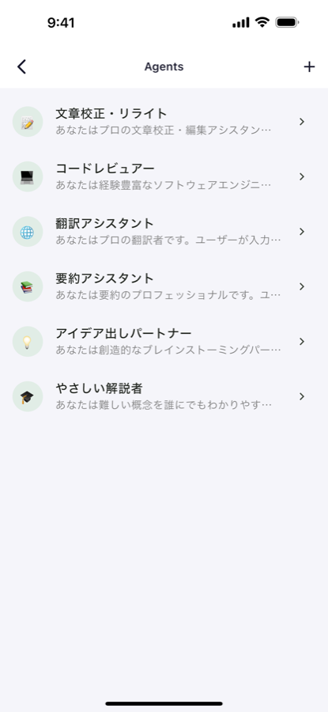
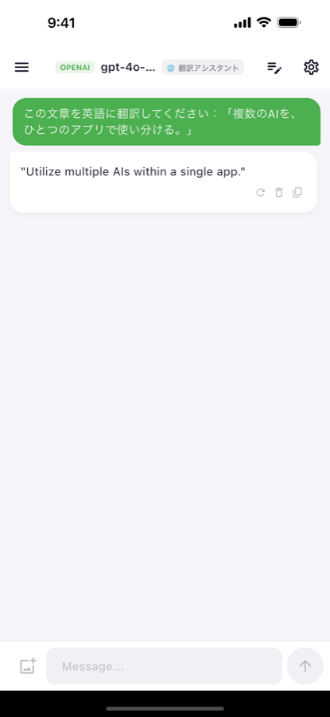
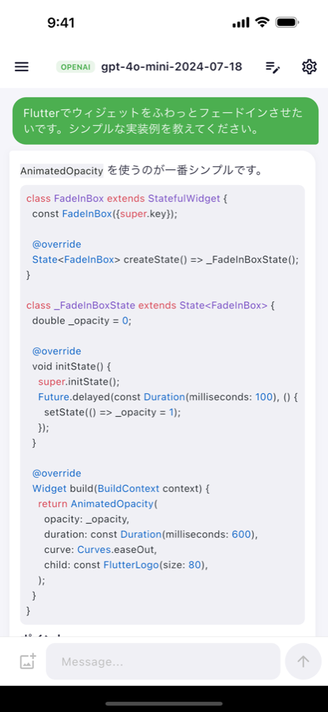
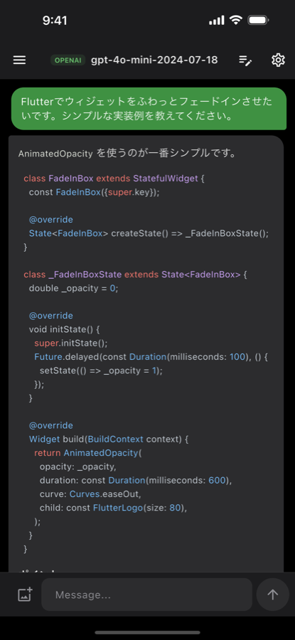

# PolyMind

**OSS なマルチプロバイダー AI チャットクライアント — OpenAI / Gemini / Claude / Ollama を1つのRepositoryインターフェースで統一**

    

### 📱 iOS 版が App Store で公開中です

[](https://apps.apple.com/jp/app/polymind/id6806156195)

無料でダウンロードいただけます。お好きなAIプロバイダーのAPIキーを入力するだけで、すぐにお使いいただけます。詳しくは[紹介ページ](https://softjapan.github.io/polymind/)もご覧ください。

---

## 概要

Flutter × Riverpod × LangChain Dart で構築した、OSSのマルチプロバイダー AI チャットクライアントです。

OpenAI・Google Gemini・Anthropic Claude・Ollama（ローカル LLM）を `LlmRepository` という単一の抽象インターフェースの背後に実装として隠蔽しており、アプリ側のロジックは接続先プロバイダーの違いを一切意識しません。設定画面からプロバイダー・モデル・エンドポイントをいつでも切り替え可能です。

APIキーは `flutter_secure_storage`（iOS/macOS: Keychain、Android: EncryptedSharedPreferences）にのみ保存され、開発者のサーバーは存在しません。チャット履歴は端末内の SQLite に永続化され、外部に送信されることはありません。

---

## デモ動画

[▶ デモ動画を見る（docs/polymind-demo.mp4）](docs/polymind-demo.mp4)

---

## スクリーンショット

<p align="center">
  
  
  
  
</p>

---

## 主な機能

| 機能 | 説明 |
|------|------|
| **マルチ LLM 対応** | OpenAI / Gemini / Claude / Ollama（ローカル LLM）を設定画面から切り替え |
| **リアルタイム・ストリーミング** | LangChain の各 Chat モデルでトークン単位のストリーム描画。生成中はいつでも即座に中断可能 |
| **画像入力（Vision）** | 写真を添付してAIに質問可能。マルチモーダルコンテンツとしてプロバイダーへ送信 |
| **画像生成** | `/image <prompt>` コマンドで OpenAI 画像生成 API を呼び出し、チャット内にサムネイル表示 |
| **フルスクリーン画像ビューア** | ピンチズーム対応のプレビュー、ローカルへのダウンロード機能 |
| **チャット履歴の永続化** | SQLite で会話・メッセージを保存、サイドドロワーから一覧・検索・リネーム・削除 |
| **応答の再生成・編集** | 直近の応答を再生成、送信済みメッセージの編集・削除に対応 |
| **セキュアな設定管理** | API キーを `flutter_secure_storage` で暗号化保存（`.env` 不要） |
| **シンタックスハイライト** | AI 応答内のコードブロックを、ライト/ダーク双方に最適化した配色で自動カラーリング |
| **Markdown レンダリング** | `flutter_markdown` による見出し・リスト・コード・リンク等の表示 |
| **ダークモード** | `ThemeExtension` ベースのカラーシステムでライト/ダークをシームレスに切り替え |
| **クロスプラットフォーム** | iOS / Android / macOS / Web に対応する単一コードベース |

---

## アーキテクチャ

```
lib/
├── main.dart                          # エントリポイント + UI ルート
├── constants.dart                     # ThemeExtension<AppColors>（ライト/ダーク配色）
├── model/
│   ├── chat_message.dart              # 不変メッセージモデル
│   ├── chatmodel.dart                 # ChangeNotifier（状態管理・生成ライフサイクル）
│   └── provider_config.dart           # LLM プロバイダー設定モデル
├── repository/
│   ├── llm_repository.dart            # LLM 抽象インターフェース（stream/generate/generateImage/listModels）
│   ├── openai_repository.dart         # OpenAI 実装（LangChain）
│   ├── ollama_repository.dart         # Ollama 実装（LangChain）
│   ├── gemini_repository.dart         # Gemini 実装（LangChain）
│   ├── claude_repository.dart         # Claude 実装（LangChain）
│   ├── secure_settings.dart           # flutter_secure_storage ラッパー
│   └── chat_database.dart             # SQLite チャット履歴（スキーママイグレーション対応）
└── widgets/
    ├── ai_message.dart                # AI バブル（Markdown + 画像 + アクション）
    ├── user_message.dart              # ユーザーバブル
    ├── user_input.dart                # 入力フィールド（画像添付・送信/停止トグル）
    ├── loading.dart                   # ローディングアニメーション
    ├── code_block.dart                # シンタックスハイライター（ライト/ダーク対応）
    ├── settings_screen.dart           # プロバイダー設定画面
    └── conversation_drawer.dart       # 会話一覧ドロワー（検索・リネーム）
```

| レイヤー | 役割 |
|----------|------|
| **Presentation** | Flutter Widgets + Material 3 + Markdown 表示。色は `context.colors` 経由で `ThemeExtension` から取得し、ハードコードしない |
| **State** | Riverpod（`ChangeNotifierProvider`）+ `ChatModel` によるメッセージ・設定・生成状態の一元管理 |
| **Repository** | `LlmRepository` を実装する4つのプロバイダークラス、LangChain経由のLLM通信、SQLite永続化、セキュア設定 |

### 設計上のポイント

- **プロバイダー抽象化** — 新しいLLMプロバイダーの追加は「`LlmProvider` enumへの追加 → `LlmRepository` 実装クラスの追加 → `ChatModel._buildRepository()` のswitchに1行追加」のみで完結する設計。UI・状態管理層はプロバイダーの違いを意識しない。
- **信頼性の高い生成中断** — 応答停止 (`stopGenerating()`) は真偽値フラグのポーリングではなく、アクティブな `StreamSubscription` を直接キャンセルし、識別トークン (`_generationToken`) を無効化する方式を採用。フラグ方式はストリームのチャンク間でしかチェックされずスタックした接続を中断できないため、この設計により低速・停止気味の接続でも確実に中断できる。
- **block-native LangChain API** — `langchain_core` 0.5系の破壊的変更（メッセージ内容が `String` から content block の `List` に変更）に対応し、`chunk.output.contentAsString` / `ChatMessage.aiText()` を使用。
- **無駄のない永続化** — 会話は「New Chat」タップ時点ではなく、最初のメッセージが送信された時点でのみ SQLite に挿入される。未使用の空チャットが履歴に残らない。

---

## 技術スタック

| カテゴリ | パッケージ | 用途 |
|----------|-----------|------|
| 状態管理 | `flutter_riverpod` | `ChangeNotifierProvider` によるアプリ全体の状態管理 |
| LLM 連携 | `langchain`, `langchain_openai`, `langchain_ollama`, `langchain_google`, `langchain_anthropic` | block-native API（v0.9系）でのストリーミング・マルチモーダル対応 |
| UI / Markdown | `flutter_markdown`, `cached_network_image` | Markdownレンダリング、画像のキャッシュ・遅延ロード |
| シンタックスハイライト | `highlight` | コードブロックのライト/ダーク両対応トークンカラーリング |
| ストレージ | `sqflite`, `flutter_secure_storage`, `path_provider` | 会話履歴のSQLite永続化、APIキーの暗号化保存 |
| 画像入力 | `image_picker` | Vision入力用の画像選択・Base64エンコード |
| ネットワーク | `http` | プロバイダーAPIとの直接通信 |
| ID生成 | `uuid` | 会話・メッセージの一意識別子 |

---

## セットアップ

### 前提条件

- Flutter 3.32 以上（Dart SDK 3.8.0 以上を同梱）— `flutter --version` で確認
- （Ollama 使用時）[Ollama](https://ollama.ai) がローカルで起動していること

### インストール

```bash
git clone https://github.com/softjapan/polymind.git
cd polymind
flutter pub get
flutter run
```

### 初回設定

`.env` ファイルは不要です。アプリ起動後、設定画面からプロバイダーを選択してください。

| 項目 | OpenAI | Gemini | Claude | Ollama |
|------|--------|--------|--------|--------|
| Endpoint | `https://api.openai.com/v1` | `https://generativelanguage.googleapis.com` | `https://api.anthropic.com` | `http://localhost:11434` |
| Model | `gpt-4o-mini-2024-07-18` 等 | `gemini-2.5-flash` 等 | `claude-sonnet-4-5` 等 | `llama3.2` 等 |
| Image Model | `gpt-image-1`（任意） | — | — | — |
| API Key | 必須 | 必須 | 必須 | 不要 |

---

## 使い方

- 通常のメッセージを送信すると、AI の応答が Markdown としてリアルタイム描画されます
- `/image <プロンプト>` または `/img <プロンプト>` で画像を生成（OpenAI のみ）
- 生成された画像はタップで全画面表示 → ピンチズーム → ダウンロード
- サイドドロワーから過去の会話を検索・切り替え・リネーム・削除
- 送信済みメッセージの編集・応答の再生成にも対応
- 設定画面から LLM プロバイダーをいつでも変更可能

---

## 開発コマンド

| 用途 | コマンド |
|------|---------|
| 依存関係の取得 | `flutter pub get` |
| アプリ起動 | `flutter run` |
| 単一テストの実行 | `flutter test test/widget_test.dart` |
| テスト全体の実行 | `flutter test` |
| 静的解析 | `flutter analyze` |
| ビルド | `flutter build ios\|apk\|macos\|web` |

---

## コントリビューション

1. リポジトリを Fork
2. ブランチを作成: `git checkout -b feature/awesome-feature`
3. コミット: `git commit -m "Add awesome feature"`
4. Push & Pull Request: `git push origin feature/awesome-feature`

---

## ライセンス

[MIT License](./LICENSE)

---

## Author

- **Twitter**: [システムエンジニア@JP](https://twitter.com/fullstack_se)
- **GitHub**: [softjapan/polymind](https://github.com/softjapan/polymind)
